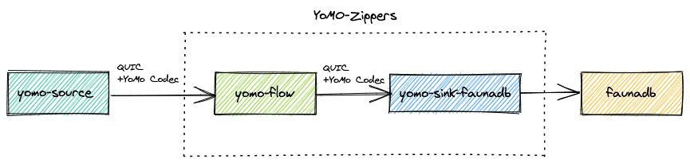

# yomo-sink-faunadb
The example shows how to implement a sink to write data to FaunaDB.


## Using Fauna

1. ### Register at https://fauna.com/

2. ### Create Database and Collection

   In this example the `noise`Collection is created

3. ### Generate `secret`


## How to write your yomo-sink-faunadb

1. ### Installing

To get yomo the latest version run:

```shell script
go get github.com/yomorun/yomo
```

To get faunadb-go the latest version run:

```shell script
go get github.com/fauna/faunadb-go/v3/faunadb
```

2. ### Importing

```go
import (
	f "github.com/fauna/faunadb-go/v3/faunadb"
	"github.com/yomorun/yomo/pkg/rx"
)
```

3. ### Creates a new FaunaClient

```go
var client *f.FaunaClient
func init() {
	client = f.NewFaunaClient(os.Getenv("FAUNA_SECRET"))
}
```

4. ### Implementation of the Handler function

   Handler functions can be called by yomo's CLI

```go
func Handler(rxstream rx.RxStream) rx.RxStream {
	stream := rxstream.
		Y3Decoder("0x10", float32(0)).
		AuditTime(100 * time.Millisecond).
		Map(store)
	return stream
}
```

5. ### Define Struct for persisting data

```go
type Noise struct {
	Value float32 `fauna:"value"`
}
```

6. Save data to FaunaDB

```go
var store = func(_ context.Context, i interface{}) (interface{}, error) {
	value := i.(float32)

	noise := Noise{Value: value}
	_, err := client.Query(f.Create(f.Collection("noise"), f.Obj{"data": noise}))
	if err != nil {
		panic(err)
	}

	return value, nil
}
```

## How to RUN

### 1. Install CLI

```bash
# Ensure use $GOPATH, golang requires main and plugin highly coupled
○ echo $GOPATH

```

if `$GOPATH` is not set, check [Set $GOPATH and $GOBIN](https://github.com/yomorun/yomo#optional-set-gopath-and-gobin) first.

```bash
$ GO111MODULE=off go get github.com/yomorun/yomo

$ cd $GOPATH/src/github.com/yomorun/yomo

$ make install
```

### 2. RUN

```go
FAUNA_SECRET=your-secret-here yomo run app.go -p 4343
```

## How yomo-sink-faunadb and yomo-zipper work




